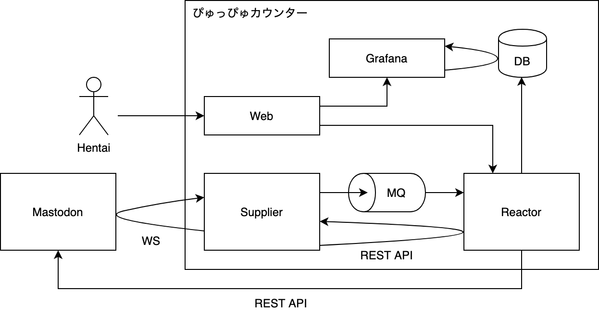

ぴゅっぴゅカウンター
====================

[ぴゅっぴゅカウンター](https://xn--y2wx43a.chitoku.jp) はぴゅっぴゅ回数をカウントして毎日真夜中にトゥートします。

## 機能

- 日々のぴゅっぴゅ回数をデータベースに記録
- 毎日真夜中にカウンターとデータベースを更新
- 「ぴゅっ♡」を含むトゥートでぴゅっぴゅカウンターを更新

## おまけ

- だいたい以下のようなトゥートで診断メーカーの結果をリプライ
  - 「ぴゅっぴゅしていい？」
  - 「おふとん入っていい？」
  - 「ちんぽに勝ちたい」
  - 「ちんぽチャレンジ」
  - 「おちんぽ挿入チャレンジ」
  - 「おちんちん握って」
  - 「○○のAV」
  - 「法律ギリギリチャレンジ」
- 「through ガチャ」

## アーキテクチャー



### Web

Grafana または REST API へのリクエストの振り分けを行います。

### Supplier

Mastodon から WebSocket でトゥートを取得し、イベントに変換して MQ へ送信します。

### Reactor

MQ からイベントを受信し、Mastodon でのリプライ送信や DB の更新などの処理を行います。  
また、REST API を実装しています。

## 設定方法

データベースの作成とテーブルの設定を行います。

```sql
CREATE TABLE `counts` (
    `id` int(11) NOT NULL AUTO_INCREMENT,
    `user` int(11) DEFAULT NULL,
    `date` date DEFAULT NULL,
    `count` int(11) DEFAULT NULL,
    PRIMARY KEY (`id`)
);
CREATE TABLE `users` (
    `id` int(11) NOT NULL AUTO_INCREMENT,
    `screen_name` varchar(20) DEFAULT NULL,
    PRIMARY KEY (`id`)
);
```

環境変数に値の設定を行います。

```bash
# DB ユーザー ID（数値）
USER_ID=

# Mastodon ユーザー ID（数値、スペース区切り）
MASTODON_USER_ID=

# Mastodon ユーザー トークン
MASTODON_ACCESS_TOKEN=

# Mastodon サーバー URL
MASTODON_SERVER_URL=

# データベース 接続情報
DB_HOST=
DB_DATABASE=
DB_USER=
DB_PASSWORD=

# メッセージキュー 接続情報
MQ_HOST=
MQ_USERNAME=
MQ_PASSWORD=
```

## 本番環境

Docker のインストールが必要です。  
nginx + RabbitMQ + MySQL + Go App で構成されています。

### ビルド

```sh
$ docker build .

$ pushd reactor/
$ docker build .
$ popd

$ pushd supplier/
$ docker build .
$ popd
```

## 開発環境

Docker Compose のインストールが必要です。

### 実行

```sh
$ docker-compose up -d
```

## メトリクス

以下のコンポーネントは Prometheus のエンドポイントを実装しています。

### Supplier

`GET /metrics`

### Reactor

`GET /metrics`
