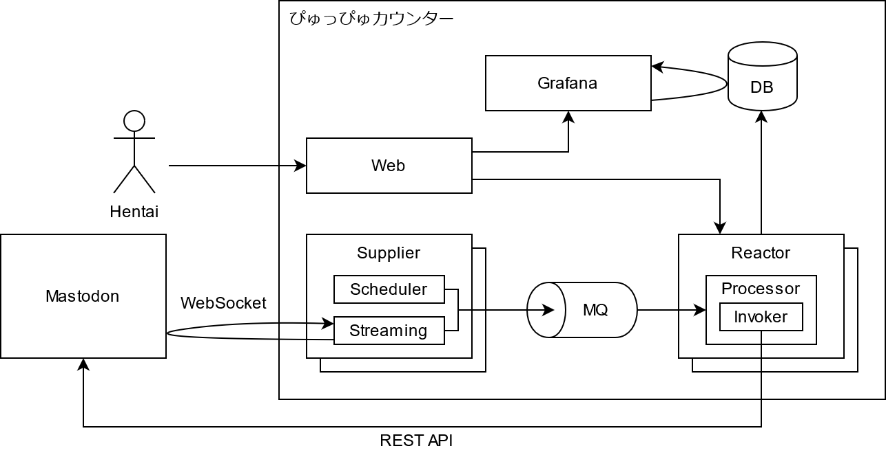

ぴゅっぴゅカウンター
====================

[![][workflow-badge]][workflow-link]

[ぴゅっぴゅカウンター](https://xn--y2wx43a.chitoku.jp) はぴゅっぴゅ回数をカウントして毎日真夜中にトゥートします。

## 機能

- 日々のぴゅっぴゅ回数をデータベースに記録
- 毎日真夜中にカウンターとデータベースを更新
- 「ぴゅっ♡」を含むトゥートでぴゅっぴゅカウンターを更新

## おまけ

- だいたい以下のようなトゥートで診断メーカーの結果をリプライ
  - 「ぴゅっぴゅしていい？」
  - 「おふとん入っていい？」
  - 「ちんぽに勝ちたい」
  - 「ちんぽチャレンジ」
  - 「おちんぽ挿入チャレンジ」
  - 「おちんちん握って」
  - 「ちんぽ揃えゲーム」
  - 「○○のAV」
  - 「法律ギリギリチャレンジ」
- 「through ガチャ」
- 「doublet ガチャ」

## アーキテクチャー



### Web

Grafana または REST API へのリクエストの振り分けを行います。

### Supplier

Mastodon から WebSocket でトゥートを取得して MQ へ送信します。

### Reactor

MQ から取得したトゥートに対し、Mastodon でのリプライ送信や DB の更新などの処理を行います。  
また、REST API を実装しています。

## 設定方法

データベースの作成とテーブルの設定を行います。  
スキーマ: [database/](./database)

環境変数に値の設定を行います。

```bash
# ログレベル（trace/debug/info/warn/error/fatal/panic）
LOG_LEVEL=

# DB ユーザー ID（数値）
USER_ID=

# Mastodon ユーザー ID（数値）
MASTODON_USER_ID=

# Mastodon ユーザー トークン
MASTODON_ACCESS_TOKEN=

# Mastodon サーバー URL
MASTODON_SERVER_URL=

# Mastodon ストリーム
# 設定値: https://docs.joinmastodon.org/methods/timelines/streaming/#websocket-a-idwebsocketa
MASTODON_STREAM=user

# データベース 接続情報
DB_HOST=
DB_DATABASE=
DB_USER=
DB_PASSWORD=

# データベース SSL モード（disable/require/verify-ca/verify-full）
DB_SSL_MODE=

# メッセージキュー 接続情報
MQ_HOST=
MQ_USERNAME=
MQ_PASSWORD=

# 外部 API
EXT_MPYW_API_URL=https://mpyw.hinanawi.net/api
```

## 本番環境

BuildKit（または Docker の対応するバージョン）あるいは Buildah のインストールが必要です。

- `docker build` を利用する場合: Docker 18.09 以上
- `docker buildx` を利用する場合: Docker 19.03 以上

nginx + RabbitMQ + PostgreSQL + Go App で構成されています。

### ビルド

```sh
$ docker buildx build .
$ docker buildx build ./reactor
$ docker buildx build ./supplier
$ docker buildx build ./mq
```

## 開発環境

Docker Compose のインストールが必要です。

### 実行

```sh
$ COMPOSE_DOCKER_CLI_BUILD=1 \
  DOCKER_BUILDKIT=1 \
  docker-compose up -d --build
```

## メトリクス

以下のコンポーネントは Prometheus のエンドポイントを実装しています。

### Supplier

`GET /metrics`

### Reactor

`GET /metrics`

[workflow-link]:    https://github.com/chitoku-k/ejaculation-counter/actions?query=branch:master
[workflow-badge]:   https://img.shields.io/github/workflow/status/chitoku-k/ejaculation-counter/CI%20Workflow/master.svg?style=flat-square
